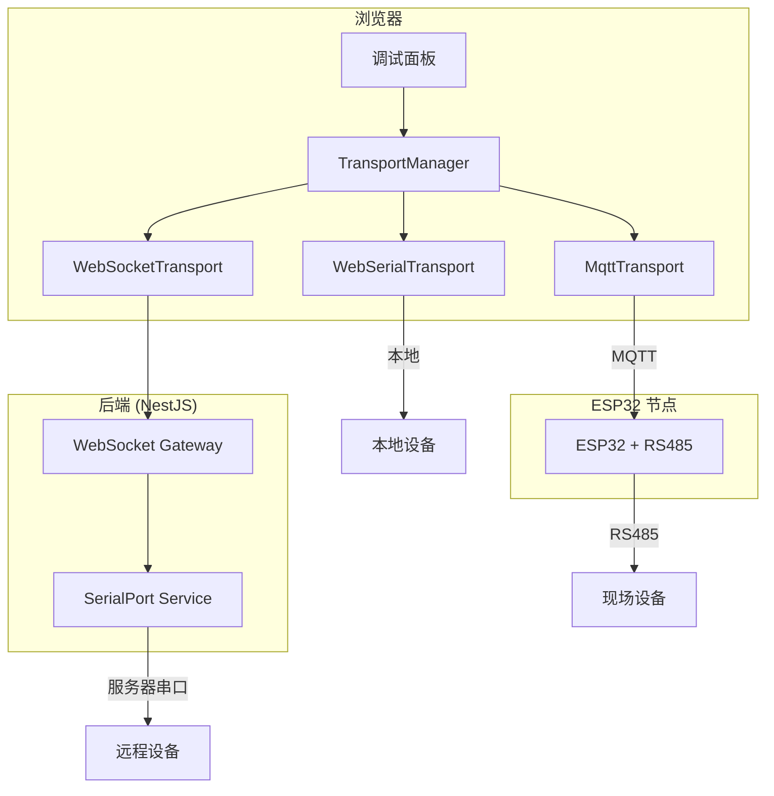
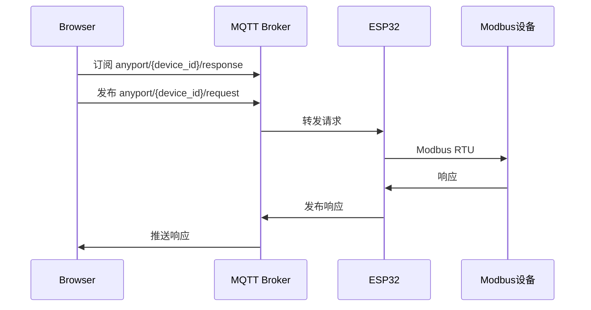

# Anyport 多协议调试工具技术实施规格说明书 (V2.0)

## 📋 项目概述

开发一个基于 Web 云端的**企业级、离线可用**的跨平台工业协议转换工具，采用**渐进式架构**：
- **第一期**：纯前端 + Web Serial + Modbus RTU + PWA
- **第二期**：后端中转 + ESP32 远程采集 + 企业用户管理

---

## 🎯 目标协议

| 协议 | 说明 | 应用场景 | 优先级 |
|------|------|---------|--------|
| **Modbus RTU** | 工业串口通信 (Web Serial) | 自动化生产线、水泵、电机控制 | ⭐ 第一期 |
| **Modbus TCP** | 工业网络通信 (需服务器/代理) | PLC、变频器网络调试 | 第二期 |
| DL/T 645 | 中国电力行业的"普通话" | 抄表、能耗监测系统、充电桩 | 第二期 |
| RS232/RS485 Hex | 通用串行通信 | 自定义设备调试 | 第二期 |
| BACnet MS/TP | 楼宇自控全球霸主协议 | 西门子、霍尼韦尔楼宇控制器 | 第二期 |
| SCPI | ASCII 文本协议 | 万用表、示波器、信号发生器 | 预留，暂不开发 |
| CAN Bus | 汽车领域总线 | 汽车电子、嵌入式系统 | 预留，暂不开发 |

---

## 🏗️ 系统架构设计

### 第一期架构（纯前端）


### 第二期架构（支持 ESP32 扩展）



### 核心设计：可插拔传输层

> **关键设计**：`ITransportAdapter` 接口是扩展性的核心。无论是 Web Serial、WebSocket 还是 MQTT (ESP32)，都实现同一接口。

```typescript
// 传输层接口 - 所有连接方式都必须实现
interface ITransportAdapter {
  readonly type: TransportType;
  connect(config: ConnectionConfig): Promise<void>;
  disconnect(): Promise<void>;
  send(data: Uint8Array): Promise<void>;
  onData(callback: (data: Uint8Array) => void): void;
}

// 第一期实现
class WebSerialTransport implements ITransportAdapter { ... }

// 第二期扩展（无需修改现有代码）
class WebSocketTransport implements ITransportAdapter { ... }
class MqttTransport implements ITransportAdapter { ... }  // ESP32
```

---

## 📁 项目目录结构

```plaintext
/anyport
├── /packages
│   ├── /shared                    # 共享类型（为第二期预留）
│   │   └── src/types/
│   │       ├── transport.types.ts # 传输层接口定义
│   │       ├── protocol.types.ts  # 协议接口定义
│   │       └── device.types.ts
│   │
│   └── /frontend                  # 第一期重点
│       ├── src/
│       │   ├── transports/        # 传输层实现
│       │   │   ├── ITransportAdapter.ts
│       │   │   ├── WebSerialTransport.ts
│       │   │   ├── WebSocketTransport.ts   # 第二期
│       │   │   └── MqttTransport.ts        # 第二期 ESP32
│       │   ├── protocols/         # 协议层实现
│       │   │   ├── IProtocolAdapter.ts
│       │   │   └── modbus/
│       │   │       ├── ModbusRtuAdapter.ts
│       │   │       ├── ModbusPanel.vue
│       │   │       └── crc16.ts
│       │   ├── stores/            # Pinia 状态管理
│       │   │   ├── deviceStore.ts
│       │   │   └── logStore.ts
│       │   ├── components/
│       │   └── App.vue
│       └── vite.config.ts         # PWA 配置
│
├── /packages/backend              # 第二期再开发
├── package.json
└── pnpm-workspace.yaml
```

---

## 📦 第一期实施计划

### 阶段 1：项目初始化

**创建文件：**
- `pnpm-workspace.yaml` - 配置工作区
- `packages/shared` - 共享类型包
- `packages/frontend` - Vue 3 + Vite + PWA

### 阶段 2：传输层抽象

**ITransportAdapter.ts**
```typescript
export enum TransportType {
  WEB_SERIAL = 'web_serial',
  WEBSOCKET_PROXY = 'websocket_proxy', // 第二期：透传 TCP
  MQTT = 'mqtt'                       // 第二期：ESP32
}

export interface ITransportAdapter {
  readonly type: TransportType;
  connect(config: ConnectionConfig): Promise<void>;
  disconnect(): Promise<void>;
  send(data: Uint8Array): Promise<void>;
  onData(callback: (data: Uint8Array) => void): void;
  onError(callback: (error: Error) => void): void;
  onStateChange(callback: (connected: boolean) => void): void;
}
```

**WebSerialTransport.ts** - Web Serial API 封装，实现 `ITransportAdapter`

### 阶段 3：Modbus 协议实现

**IProtocolAdapter.ts**
```typescript
export enum ProtocolType {
  MODBUS_RTU = 'modbus_rtu',
  MODBUS_TCP = 'modbus_tcp',
  DLT645 = 'dlt645',          // 第二期
  CAN_BUS = 'can_bus'         // 第二期
}

export interface IProtocolAdapter {
  readonly protocolType: ProtocolType;
  encode(command: ProtocolCommand): Uint8Array;
  decode(data: Uint8Array): ProtocolResponse | null;
  checkFrame(buffer: Uint8Array): FrameCheckResult;
}
```

**ModbusRtuAdapter.ts**
- 功能码：01/02/03/04/05/06/15/16
- CRC-16 Modbus 校验
- 请求/响应帧解析

**ModbusPanel.vue** - 调试界面

### 阶段 4：PWA 离线支持

配置 `vite-plugin-pwa`，启用离线缓存。

---

## 🔮 第二期扩展规划

| 功能 | 实现方式 | 说明 |
|------|---------|------|
| **服务器中转** | `WebSocketTransport` | 实现 `ITransportAdapter` |
| **ESP32 远程采集** | `MqttTransport` | ESP32 通过 MQTT 上报数据 |
| **智能解析引擎** | 点表数据库 + 解析器 | 自动匹配厂家点表将 Hex 解析为物理量 |
| **用户管理** | `packages/backend` | NestJS + PostgreSQL |
| **云端日志** | 后端 API | 替代本地 IndexedDB |

### ESP32 方案预览



---

## ✅ 验证计划

| 测试项 | 方法 | 验收标准 |
|-------|------|---------|
| Modbus CRC | 单元测试 | 与标准 CRC 计算器结果一致 |
| Web Serial 连接 | 人工测试 | 能选择串口并建立连接 |
| Modbus 读写 | 真实设备 | 能正确读取保持寄存器 |
| PWA 离线 | DevTools Offline | 离线后应用仍可加载 |

---

## ⏱️ 时间估算

| 阶段 | 预计工时 |
|------|---------|
| 阶段 1：项目初始化 | 1-2 小时 |
| 阶段 2：传输层抽象 | 3-4 小时 |
| 阶段 3：Modbus 实现 | 5-6 小时 |
| 阶段 4：PWA 支持 | 1-2 小时 |
| **第一期总计** | **10-14 小时** |
